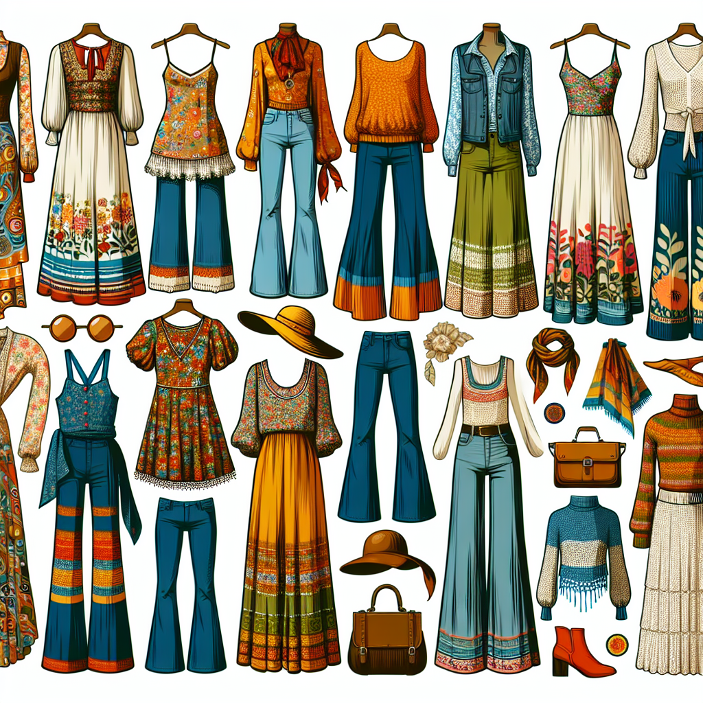

Welcome back to yet another enticing blog post! Today, we're exploring the vibrant world of 70s fashion.

# Bohemian Vibes: An Age of Nonconformity and Freedom

Long before Coachella made Bohemian fashion a runaway trend, 70s icons were flaunting dreamy, relaxed styles with impeccable swagger [External Link](https://www.vam.ac.uk/articles/the-1970s-fashion-decade).

# Disco Fever: When Fashion Never Slept

Disco ruled the airwaves and our wardrobes in the 70s. Sequined tube tops, hot pants, shiny satin dresses - it was all about bold self-expression back then [Video: Golden era of Disco Fashion](./disco_fashion.mpg)

# Punk Movement: The Sartorial Rebellion

As the 70s progressed, punk fashion started to emerge as a rebellion against the 'establishment' . You can learn more about punk fashion from our [Fashion Historian Blog Post](https://example.com/blog/punk-fashion)

> "Fashion in the 70s was about so much more than clothes - it was influenced by the socio-political climate of the time."

# Ready for Vintage Style? 

So, what’s stopping you from embracing these vintage styles? [Check out our summer collection here](https://example.com/shop/summer-collection)