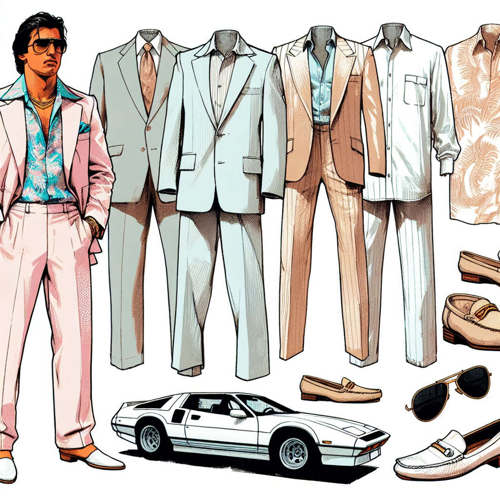

The 1980s were an unforgettable era characterized by wild and wacky fashion styles. Let's buckle up in our metaphorical DeLorean and revisit the rich, vibrant trends that continue to shape contemporary fashion.

## Power Suits: Dressing to Impress

Power suits with shoulder pads were in vogue during this transformative era. They emanated a sense of strength and ambition, especially among women. As Michael Douglas stated through his iconic character Gordon Gekko in Wall Street, "greed is good". This encapsulated the Yuppie- short for young urban professionals- mindset which was key in influencing the fashion trends of this era.

## Bright and Bold: Make Your Mark with Neon

Neon was everywhere during the 80s, i.e., clothes, accessories, and bands. These striking hues became a fashion statement- a visual shout out to the world that screamed "Hey, look at me!"

## Punk: The Rebellion Continues

Punk fashion took new forms in the 80s - bands began to adopt a more hardcore and aggressive look with leather jackets, ripped jeans, and band t-shirts, becoming a complete lifestyle.

## The Mini Skirt: Flaunt it if You’ve got it!

First introduced in the swinging 60s, the miniskirt lived on in the 80s but with a twist. Denim, leather, and even lycra miniskirts started becoming a staple in everyone's wardrobe, reflecting the boldness of the era.

## Rocking the Radical: Wild Hair Dos

Bigger was better when it came to hair in the 80s. Business-casual mullets, hair metal perms, and new-wave extension experiments defined the decade, representing another facet of radical self-expression during the era.

## Distressed to Impress: Acid-Washed Denim

This style might seem extreme today, but acid-washed denim was all the rage in the 80s. Initially invented using pumice stones for a faded appearance, acid wash jeans gave a weathered and rugged look treasured by many fashion enthusiasts during the 80s.

## Fitness & Fashion: Comfort in Style

In the 80s, fitness wasn't limited to the gym - it was a cultural phenomenon that influenced fashion significantly. Leg warmers, leggings and stirrup pants coupled with high-energy aerobics classes defined the era. Moreover, people often donned their athletic gear out on the town, whether or not they intended to exercise.

## Adding Color to Life: A Makeup Revolution

The 80s were all about vibrant, boundary-pushing visual styles. The onset of music television during this period made visual expression more important, driving people to reflect these styles in everyday life using extravagant makeup.

## The Showstoppers: Hair Accessories 

The scrunchie, a fabulously strong hair tie covered in varying colors and fabrics was the must-have hair accessory of the 80s. This versatile accessory complemented a wide array of styles, from the yuppie look to the neon trend.

## Turn Up The Heat: Miami Heat Inspired Wardrobes

Popular TV shows like 'Miami Vice' also influenced fashion with white sport coats, pastel colors, designer stubble and Ray-ban wayfarers becoming staples in everyone's wardrobe.

> "The 80s gave birth to countless enduring styles. From power suits and neon to the rise of athleisure, this exciting decade was a game-changer."

## Invoking the Power Dressing Era
Stepping into the 80s wardrobe today offers a fusion of bold, diverse, and iconic styles. Why not add a touch of 80s energy to your fashion sense today? [Experience the electric era and invigorate your style with our 80s inspired collection!](https://example.com/shop/retro-collections)