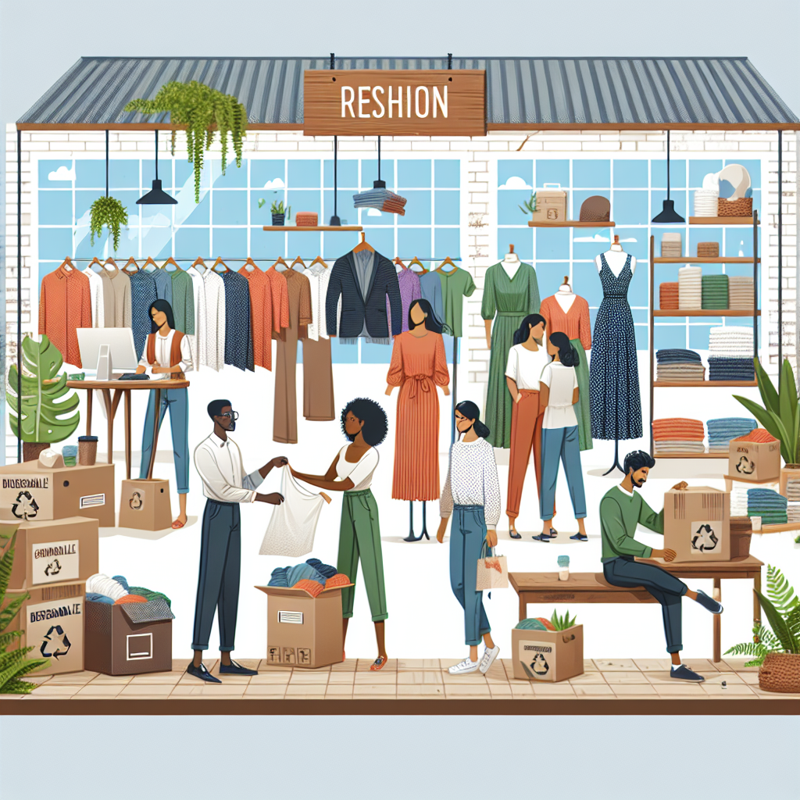
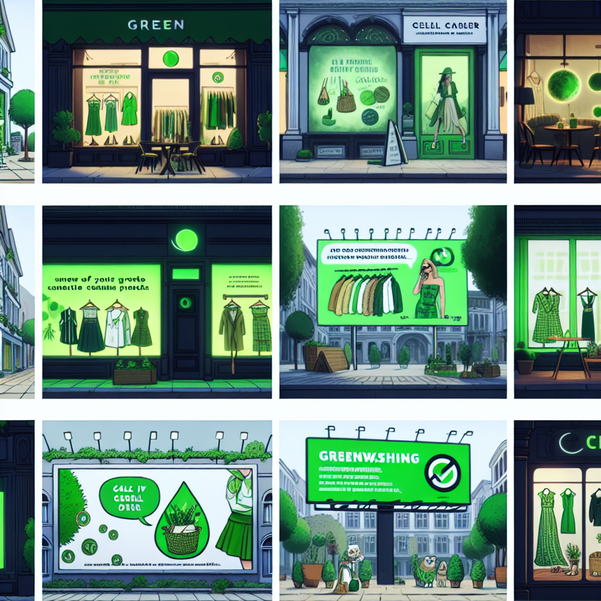

With alarming reports of climate change and environmental degradation hitting our screens daily, there's a growing trend of consumers seeking out more sustainable and 'green' products. However, not everything that glitters is gold. Are we truly shopping sustainably, or are fashion giants simply riding the 'green' wave as part of a greenwashing strategy? Let's delve deep into the sphere of sustainable fashion and expose the truth about greenwashing.

# Understanding Sustainable Fashion

Sustainable fashion is a concept that incorporates eco-friendly practices throughout every stage of a garment’s life cycle, from design to disposal. This means using responsibly-sourced materials, minimizing waste during production, ensuring fair conditions for workers, and encouraging consumers to care for their clothes in a way that prolongs their life and ultimately using recycling initiatives to prevent clothes ending up in the landfill. With this in mind, sustainable fashion promotes an environment- and socially-conscious mindset not only in designing and manufacturing but in consumption as well. Let’s take a look at how the fashion industry is working towards achieving these goals.

# Greenwashing: The Ugly Side of Fashion's 'Going Green' Trend

However, much like the fashion industry's notorious reputation for chasing trends, it has not been immune to the practice of 'greenwashing'. Greenwashing is when a company makes misleading claims or exaggerates about the environmental benefits of its products or services. This is a tactic designed to make an organization seem more environmentally friendly than it actually is. Silkily worded phrases implying sustainability or photographs of nature on clothing labels can mislead conscientious shoppers into believing they are making a green choice when the reality may be quite different. The truth behind the manufacturing process may be a far cry from the eco-friendly bliss that clothing brands often portray.

# How to Spot Greenwashing In the Fashion Industry

Greenwashing can be hard to spot. Some common tactics include vague language (is 'environmentally friendly' fabric really better, or is it just less bad?), irrelevant claims (emphasizing one tiny green initiative while ignoring bigger environmental harms), or flat out lies. To avoid falling for greenwashing, consumers need to be informed. They can research a brand's environmental policies, check for certifications from credible third-party sustainability standards, or seek out transparency reports.

# Championing Genuine Sustainable Fashion Brands

Despite the challenges posed by greenwashing, there are genuinely sustainable fashion brands out there. Brands like Patagonia, People Tree, and Reformation make concerted efforts to reduce their environmental impact by using recycled or organic materials, limiting water and energy consumption in production, ensuring fair wages for workers, and offering repair and take-back programmes. When we support these brands, we are using our purchasing power to back a more sustainable and ethical fashion industry.

Sources cited:

- ["The Truth About Sustainable Fashion"](http://www.nationalgeographic.com) from National Geographic 
- ["Fashion's Greenwashing Problem"](http://www.businessoffashion.com) from The Business of Fashion 
- ["10 Steps to Knowing if a Brand is Greenwashing"](http://www.goodonyou.com) from Good On You

In conclusion, it's important for us as consumers to be vigilant and do our bit for our planet by supporting the real heroes of sustainable fashion. Keep a discerning eye out for greenwashing and remember to shop sustainably and responsibly- the world is in your hands! With sustainability at the forefront of our choices, we can ensure a more sustainable planet for future generations.