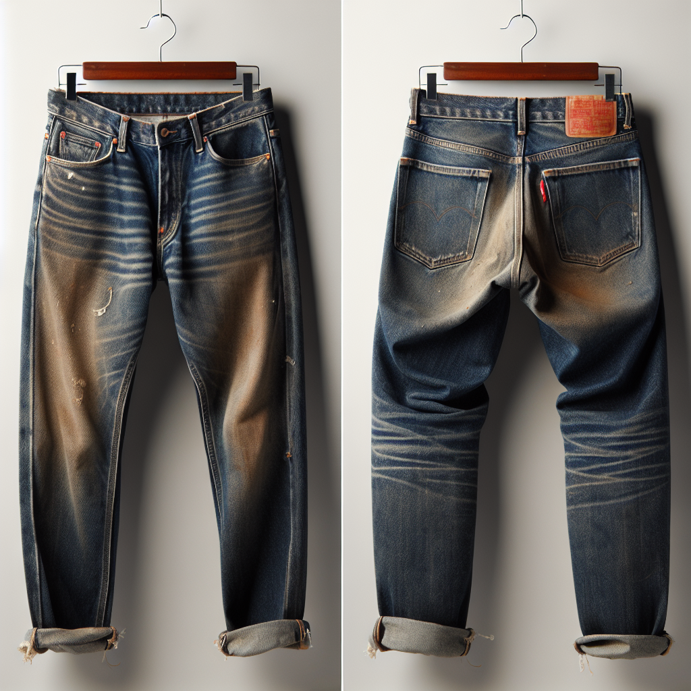
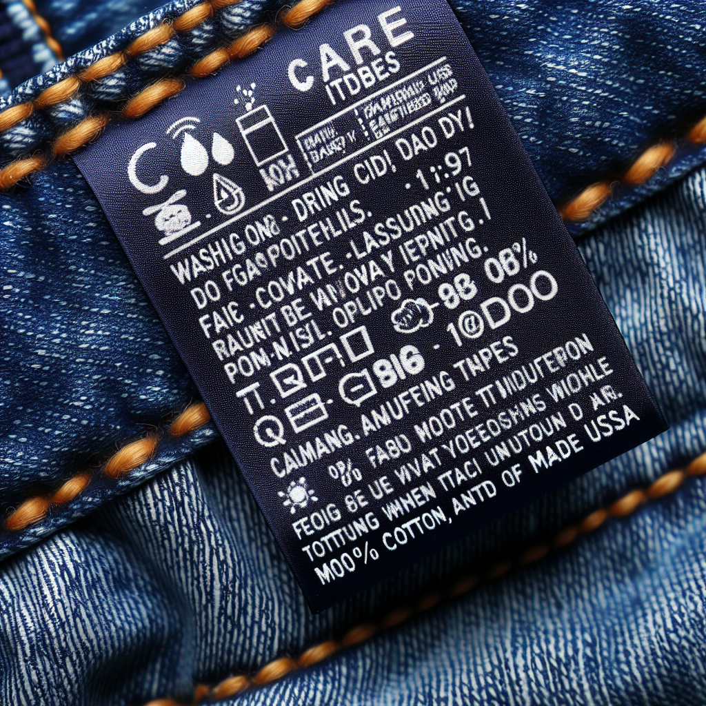

A pair of classic denim jeans is a timeless wardrobe staple—one that has effortlessly transitioned from Western cowboy attire to a modern-day fashion statement. Among this variety, the Vintage Levis 501 jeans have become a universally recognized symbol of simple yet stylish wearability. This article aims to provide you with a concise guide on how to buy the perfect pair of Vintage Levis 501 jeans and find your size.

# History & Appeal of Vintage Levi's 501 Jeans

The Levi's brand has been pivotal in shaping the world of denim[^1^]. The appeal of vintage Levis 501 lies in its timeless design, durability, and comfort[^1^]. These jeans have transcended generations, becoming a beloved garment for people of all ages.[^3^]

# How and Where to Buy Genuine Vintage Levis 501

When it comes to buying authentic vintage Levis 501, there’s a range of options available. You may scour online platforms such as eBay, Etsy, or dedicated vintage online stores. Alternatively, don't underestimate the value of locally thrift shops or vintage fairs!

# Decoding Levi's 501 Measurements

Understanding Levi's 501 measurements— waist, length, and rise—is crucial in finding a pair that feels made for you. Be sure to refer to detailed sizing guides or instructional videos from Levi’s official website for accurate measurements[^2^].

# Finding Your Perfect Fit

To find the perfect fit, you must first understand your own measurements. Using a soft measuring tape, take your waist, inseam, and hip measurements. Compare this with Levi's sizing to find your ideal jeans[^2^].

# Caring for Your Vintage Levi's 501

Taking care of vintage denim is an art in itself. Given the timeless nature of these jeans, it's crucial to understand how to maintain their pristine quality.

# Embrace the Timeless Style

In conclusion, scooping up the perfect pair of vintage Levis 501 jeans can add an everlasting charm to your wardrobe. You are now equipped with all the necessary tools and knowledge to plunge into the vintage fashion market and capture your dream pair. Happy hunting!

# Keywords: 

Vintage Levis 501, How to buy vintage Levis, Levis 501 sizing, Levis 501 fit guide, vintage denim care.

# Sources

[^1^]: [A Brief History of Blue Jeans](https://www.levistrauss.com/2015/05/01/a-brief-history-of-blue-jeans)
[^2^]: [How to Measure Your Jeans](https://www.levi.co.za/how-to-measure-your-jeans)
[^3^]: [Vintage Levi's 501 Jeans – The Ultimate Collector's Guide](https://www.highsnobiety.com/2017/06/06/vintage-levis-501-jeans-guide)